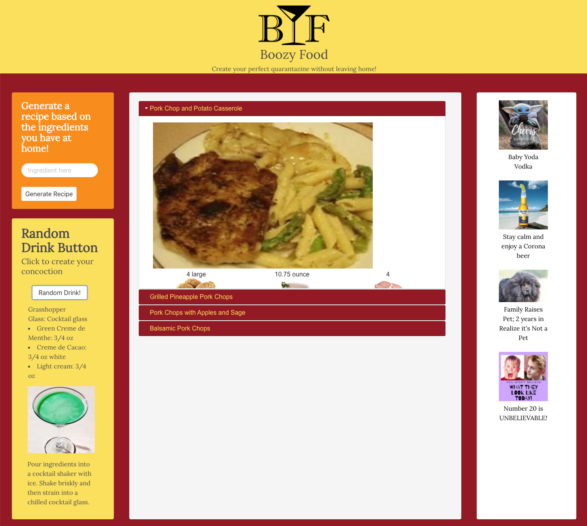

## Table of Contents
##### 1. [Project Description](#Project-Description)
##### 2. [GitHub Address](#GitHub-Address)
##### 3. [License Type](#License-Type)
##### 4. [Dependencies](#Dependencies)
##### 5. [Test Run Commands](#Test-Run-Commands)
##### 6. [Author Contact Information](#Author-Contact-Information)
---
# **Boozy Food**

### **Project Description:**
##### This site was inspired by not having easy access to a grocery store while COVID-19 was disrupting the supply chain in grocery stores. The Spoontacular API would generate several recipes based on up to three food items you have at your disposal. On the left-hand side, we added a random drink generator to give you inspiration for a drink of your choice you'd like to make. The color palette consists of warm tones.
---
### **GitHub Address:**
[Boozy Food](https://github.com/rysiphoto/Boozy-Food)
---
### **License Type:**
##### MIT

---
### **Dependencies**
##### npm i
---
### **Technologies Used**
##### HTML, JavaScript, CSS, Bulma UI, External APIs, jQuery
---
### **Test Run Commands**
##### node index
---
### **Image**

##### 

---
### **Author Contact Information:**

* Ryan Siverson
* rcsskier@mac.com
* [GitHub](https://github.com/rysiphoto)
* [LinkedIn](https://www.linkedin.com/in/ryan-siverson-695b5a32/)

---
---
###### © Ryan Siverson 2020
